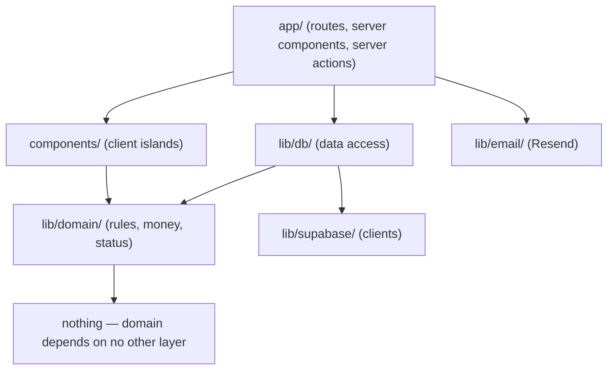
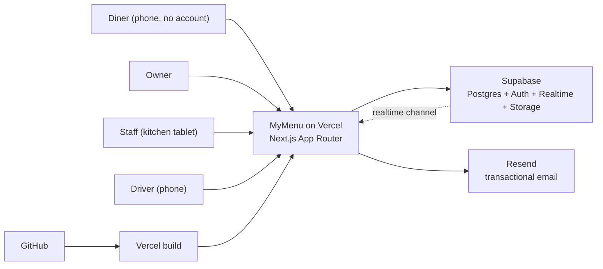
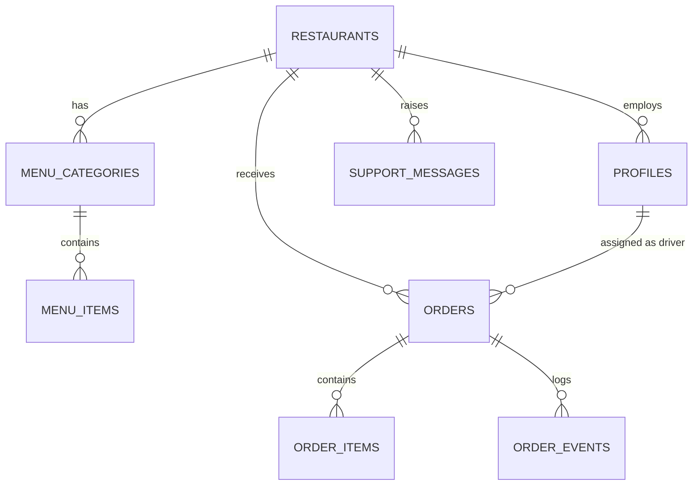
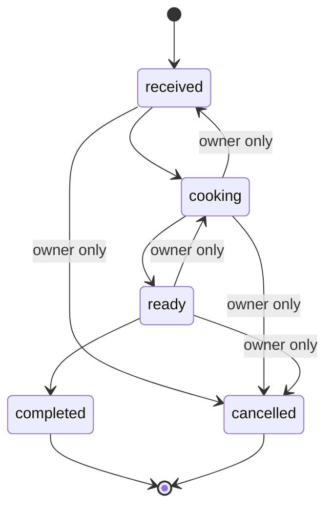

# Architecture Spine — MyMenu

## Design Paradigm

**Server-first layered web app on a managed backend.** Next.js App Router
renders on the server by default; interactivity is added as small client islands.
Supabase provides Postgres, authentication, realtime, and file storage. There is
no separate API service and no ORM layer — the database is reached directly, and
**the database itself enforces who may see what.**

Layers map to directories:

| Layer | Lives in | Owns |
|---|---|---|
| Route / surface | `app/` | URLs, layouts, server components, server actions |
| Interaction | `components/` | Client islands: cart, status advance, toggles |
| Domain | `lib/domain/` | Order status rules, savings arithmetic, money |
| Data access | `lib/db/` | Typed Supabase queries, one module per entity |
| Platform | `lib/supabase/`, `lib/email/` | Client construction, transport |



Dependency direction is one-way and downward. `lib/domain/` imports nothing from
the layers above it; a domain rule that needs a database read is the wrong shape
and belongs in `lib/db/`.

## Invariants & Rules

### AD-1 — Tenancy is enforced by the database, not by the application

- **Binds:** all — every table, every query, FR-6 especially
- **Prevents:** a forgotten `.eq('restaurant_id', …)` in one query leaking one
  restaurant's orders, menu, or customer list to another. This is the failure
  that ends the business, and it is a one-line mistake in application code.
- **Rule:** every table carries `restaurant_id` and has Row Level Security
  enabled with a policy scoped to the requester's restaurant. The service-role
  key is never used to serve a user request — only in migrations and scheduled
  jobs. A table shipped without an RLS policy is a release blocker.

### AD-2 — Order lines are snapshots, never references

- **Binds:** FR-16, FR-26
- **Prevents:** an Owner editing a price and silently rewriting last month's
  revenue, the Savings Counter, and every past receipt.
- **Rule:** `order_items` stores `name_snapshot`, `unit_price_snapshot`, and
  `quantity` copied at confirmation. It keeps `menu_item_id` only as a nullable
  soft link for reporting. Deleting a Menu Item never touches an Order.

### AD-3 — A Diner is never an authenticated user

- **Binds:** FR-13 … FR-17
- **Prevents:** drifting into building accounts, profiles, and password resets
  for diners — which would destroy the sub-60-second ordering goal (SM-4) and is
  explicitly not the product.
- **Rule:** the Ordering Page is fully public. Orders are created through a
  server action that validates input and writes with a restricted role. A Diner
  is identified only by phone number, and reads their own Order solely through
  an unguessable `order_ref` (a 22-character random token, never a sequential
  id).

### AD-4 — Order Status moves forward only, and the database says so

- **Binds:** FR-20, FR-22
- **Prevents:** a double-tap, a stale tab, or a retried request moving a *ready*
  order back to *cooking*, and two staff members fighting over one card.
- **Rule:** transitions are constrained by a database trigger:
  `received → cooking → ready → completed`. Backward moves and `cancelled` are
  permitted only for a User with the Owner Role. Every transition appends a row
  to `order_events` with actor and timestamp; the current status is derived
  state kept on `orders` for query speed, and the event log is the truth.

### AD-5 — The Savings Counter is computed, never stored

- **Binds:** FR-24
- **Prevents:** a cached or cron-written figure drifting from reality. The one
  number that must never be wrong is the one number a stored value would
  eventually get wrong.
- **Rule:** computed on read from completed Orders in the current month ×
  `commission_assumption`, minus the subscription fee, clamped at zero. It lives
  in a single function in `lib/domain/savings.ts` with unit tests, is used by
  both the dashboard and the landing-page estimator, and exists nowhere else.

### AD-6 — Money is integer minor units

- **Binds:** all price, total, and savings handling
- **Prevents:** floating-point drift producing a total that is one halala off,
  on the exact screen whose credibility is the entire product.
- **Rule:** every monetary value is an integer count of halalas
  (`45.50 SAR → 4550`) in the database, in transit, and in domain code.
  Conversion to a display string happens once, in `lib/domain/money.ts`. No
  `float` and no `number` arithmetic on currency outside that module.

### AD-7 — Realtime is an enhancement; correctness never depends on it

- **Binds:** FR-17, FR-19, FR-21
- **Prevents:** the worst failure in the product — a kitchen believing it is a
  quiet night while orders pile up unseen (EXPERIENCE.md § State Patterns).
- **Rule:** every live surface subscribes to Supabase Realtime *and* polls every
  10 seconds. Losing the socket degrades silently to polling; losing both raises
  the persistent banner. No write path depends on a realtime message being
  delivered.

### AD-8 — Server Components by default

- **Binds:** all surfaces
- **Prevents:** the whole app drifting client-side, shipping the data layer to
  the browser and putting keys where they can be read.
- **Rule:** a component is a Server Component unless it needs state, an effect,
  or an event handler. `'use client'` marks a leaf island — cart, quantity
  stepper, status advance, availability toggle, savings count-up, language
  switch — and never a page or layout. Mutations go through server actions with
  Zod-validated input; there are no route handlers for our own forms.

### AD-9 — Secrets are server-only, and there are exactly two Supabase clients

- **Binds:** all
- **Prevents:** the service-role key reaching a bundle, which would make AD-1
  decorative.
- **Rule:** `lib/supabase/server.ts` (cookie-bound, per request, anon key + user
  session) and `lib/supabase/admin.ts` (service role, importable only from
  server-only modules, guarded by `import 'server-only'`). Any other Supabase
  client construction is a review failure. Only `NEXT_PUBLIC_*` variables may be
  referenced from a client island.

### AD-10 — Direction is an attribute, not a second stylesheet

- **Binds:** every surface, EXPERIENCE.md § Bilingual and RTL
- **Prevents:** an Arabic build that slowly diverges from the English one.
- **Rule:** all directional CSS uses logical properties
  (`margin-inline-start`, `padding-inline`, `text-align: start`). `dir` is set
  once on `<html>` from the resolved language. Physical `left`/`right` in
  application styles is a review failure, excepting numerals, currency, phone
  numbers, and the logo, which never mirror.

### AD-11 — Every user-facing string comes from the dictionary

- **Binds:** all
- **Prevents:** an interface that is 90% bilingual, which is the same as not
  bilingual.
- **Rule:** no literal user-facing text in JSX. Strings live in
  `lib/i18n/ar.ts` and `lib/i18n/en.ts` with identical key sets; a key present
  in one and missing from the other fails the build. Menu Item text is user data
  and is exempt.

## Consistency Conventions

| Concern | Convention |
|---|---|
| Database naming | `snake_case`, plural tables (`menu_items`), `id uuid primary key default gen_random_uuid()`, `created_at timestamptz not null default now()` on every table |
| TypeScript naming | `PascalCase` types and components, `camelCase` values, files `kebab-case.ts`; DB rows map to types generated by `supabase gen types`, never hand-written |
| Money | Integer halalas everywhere; formatted only by `lib/domain/money.ts` (AD-6) |
| Dates | `timestamptz` in UTC in the database; rendered in the Restaurant's timezone, which is a column on `restaurants`, never the server's timezone |
| Ids | `uuid` internally; `order_ref` is a 22-char nanoid used in URLs (AD-3); nothing sequential is ever exposed |
| Validation | One Zod schema per server action in the same file, input parsed before any database call, no exceptions |
| Errors | Server actions return `{ ok: true, data }` or `{ ok: false, error }` — never throw across the boundary. Messages are dictionary keys, not sentences (AD-11) |
| Auth checks | Every server action begins by resolving the session and Role; RLS is the backstop, not the only check (AD-1) |
| Logging | Structured `console` on the server with `restaurant_id` and `order_id` where relevant; never log a phone number or an email body |
| Config | All environment variables declared and parsed in `lib/env.ts` at startup; a missing variable fails the boot loudly, not the first request |
| Styling | Tailwind utilities against tokens generated from DESIGN.md frontmatter; no inline hex values in components |
| Migrations | SQL files in `supabase/migrations/`, forward-only, committed with the code that needs them |

## Stack

Installed and verified by a passing production build on 2026-08-05. The
lockfile owns this table from here.

| Name | Version |
|---|---|
| TypeScript | ^5 |
| Next.js (App Router, Turbopack) | 16.3.0 |
| React | 19.2.8 |
| Tailwind CSS | ^4 |
| Supabase Postgres | managed (free tier) |
| `@supabase/supabase-js` | ^2 |
| `@supabase/ssr` | ^0.6 |
| Zod | ^3 |
| Resend (transactional email) | ^4 |
| `nanoid` | ^5 |
| `qrcode` + `pdf-lib` (Table QR sheet) | ^1.5 / ^1.17 |
| Vitest (domain unit tests) | ^2 |
| Playwright (MCP-driven smoke checks) | ^1 |
| Node | 20.9+ (Next 16 minimum) |
| Vercel | hosting, preview per branch |

**Next.js 16 notes that bind this codebase.** Turbopack is the default builder
for both `next dev` and `next build`. `cookies()`, `headers()`, and route
`params` / `searchParams` are **async only** — synchronous access was removed.
The `middleware` convention is renamed to **`proxy.ts`** (Node runtime only, not
edge), which is what the auth-gate in story 1.8 will use. `next lint` is gone;
ESLint runs directly from its flat config. `revalidateTag` now takes a
`cacheLife` profile as a second argument, and `updateTag` is the read-your-writes
variant to use inside server actions.

## Structural Seed

### System context



### Core entities



- `restaurants` — name, slug, timezone, opening hours, `commission_assumption`,
  `delivery_enabled`, subscription status.
- `profiles` — one row per auth user; `restaurant_id`, `role`
  (`owner`/`staff`/`driver`), name, language, notification preferences.
- `menu_categories` / `menu_items` — ordered, with `is_available` on items.
- `orders` — `order_ref`, `fulfilment_mode`, `table_number`, `address`,
  `diner_phone`, `note`, `status`, `total_halalas`, `assigned_driver_id`,
  `flagged_reason`.
- `order_items` — snapshots per AD-2.
- `order_events` — append-only transition log per AD-4.
- `support_messages` — contact-form submissions, retained for reply.
- `customers` — **a view**, not a table: distinct `diner_phone` per restaurant
  with order count and last-order date. Deriving it means it can never drift
  from the orders it summarises.

### Order status machine



### Source tree

```text
mymenu/
  app/
    (public)/
      page.tsx                  # Landing Page (FR-7, FR-8)
      r/[slug]/page.tsx         # Ordering Page (FR-13 … FR-16)
      o/[ref]/page.tsx          # Diner order status (FR-17)
      support/page.tsx          # FAQs + contact form (FR-31 … FR-32)
    (auth)/
      login/ signup/ forgot/ reset/[token]/
    (app)/
      dashboard/page.tsx        # Owner Home (FR-23 … FR-24)
      menu/page.tsx             # Menu editor (FR-9 … FR-12)
      orders/page.tsx           # Order history (FR-26)
      customers/page.tsx        # Customer List (FR-25)
      kitchen/page.tsx          # Order Screen — Staff Home (FR-18 … FR-20)
      deliveries/page.tsx       # Driver Home (FR-22)
      team/page.tsx             # Invite/remove (FR-5)
      settings/page.tsx         # Account · Preferences · Security · Restaurant
    actions/                    # server actions, one file per feature area
  components/                   # client islands only
  lib/
    domain/  money.ts savings.ts order-status.ts
    db/      restaurants.ts menu.ts orders.ts customers.ts
    supabase/ server.ts admin.ts client.ts
    i18n/    ar.ts en.ts
    email/   resend.ts
    env.ts
  supabase/
    migrations/                 # forward-only SQL, RLS policies included
  docs/                         # this spine and its companions
```

### Deployment and environments

| Environment | Host | Database | Purpose |
|---|---|---|---|
| Local | `next dev` | Supabase project (dev) | Development |
| Preview | Vercel, per branch | same dev Supabase project | Review before merge |
| Production | Vercel, `main` | Supabase project (prod) | The live link handed to the investor |

GitHub is the source of truth; Vercel builds every push and deploys `main` to
production. Two Supabase projects keep demo data out of the live site — the demo
must be reproducible on the day of the presentation, which is a real
architectural requirement here, not a nicety.

Environment variables, all declared in `lib/env.ts`:
`NEXT_PUBLIC_SUPABASE_URL`, `NEXT_PUBLIC_SUPABASE_ANON_KEY`,
`SUPABASE_SERVICE_ROLE_KEY`, `RESEND_API_KEY`, `SUPPORT_INBOX`,
`NEXT_PUBLIC_SITE_URL`.

## Capability → Architecture Map

| Capability | Lives in | Governed by |
|---|---|---|
| Accounts and access (FR-1 … FR-6) | `app/(auth)/`, `lib/supabase/server.ts` | AD-1, AD-9 |
| Landing Page + estimator (FR-7, FR-8) | `app/(public)/page.tsx` | AD-5, AD-6, AD-8 |
| Menu management (FR-9 … FR-12) | `app/(app)/menu/`, `lib/db/menu.ts` | AD-1, AD-8 |
| Ordering Page (FR-13 … FR-17) | `app/(public)/r/[slug]/`, `app/(public)/o/[ref]/` | AD-2, AD-3, AD-6, AD-7 |
| Order Screen (FR-18 … FR-20) | `app/(app)/kitchen/` | AD-4, AD-7 |
| Driver handoff (FR-21, FR-22) | `app/(app)/deliveries/` | AD-1, AD-4, AD-7 |
| Owner Dashboard (FR-23 … FR-26) | `app/(app)/dashboard/`, `lib/domain/savings.ts` | AD-5, AD-6 |
| Account / Settings / Security (FR-27 … FR-30) | `app/(app)/settings/` | AD-1, AD-10, AD-11 |
| Support (FR-31 … FR-33) | `app/(public)/support/`, `lib/email/` | AD-8, AD-11 |

## Deferred

- **Online card payment** — out of MVP scope (PRD §6.2). Deferred deliberately:
  `orders` already carries `total_halalas`, so adding a payment provider later
  is an added table and a status, not a reshape.
- **Multi-branch** — a `branches` table between `restaurants` and everything
  scoped to a location. Deferred because introducing it now would double the
  RLS surface before a single customer has asked. `restaurant_id` remains the
  tenancy key until then.
- **Loyalty and win-back messaging** — needs a messaging provider and consent
  handling; the `customers` view is the foundation and is already in place.
- **Background jobs / scheduling** — nothing in the MVP needs a cron. When
  subscriptions bill automatically, revisit.
- **Caching and read replicas** — no measured problem. Next.js request
  memoisation is sufficient at this size.
- **Observability beyond Vercel logs** — an error tracker is worth adding before
  the first paying restaurant, not before the presentation.
- **Automated test depth** — unit tests are required on `lib/domain/` (money,
  savings, status) because those three are where a silent wrong number would do
  real damage. Broader coverage is deferred to after the demo.
